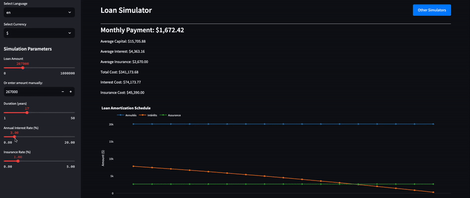

# Loan Simulator

<p align="center">
   <a href="https://twitter.com/cz_antoine"></a>
   <a href="https://www.linkedin.com/in/antoine-cichowicz-837575b1"></a>
   <a href="https://github.com/czantoine/Loan-Simulator"></a>
</p>

## Access the Application

You can access the **Loan Simulator** online without needing to deploy it locally. Visit the following link to use the application:

[**Loan Simulator**](https://loansimulator.streamlit.app/)

## Description

The **Loan Simulator** is a web application built with Streamlit that helps users calculate and visualize the details of a loan. The app allows users to input various parameters, including loan amount, duration, interest rate, and insurance, to simulate an
d understand the financial impact of a loan.



## Features

- **Interactive UI:** Users can adjust loan parameters using sliders and input fields.
- **Detailed Breakdown:** Provides monthly payments, including average capital, interest, insurance cost, and total cost.
- **Amortization Schedule:** Displays a table showing the breakdown of payments, interest, insurance, and remaining capital over time.
- **Multi-language Support:** Available in English and French.

## Getting Started

1. **Application deployment:**

   ```bash
   git clone https://github.com/czantoine/Loan-Simulator.git
   cd loan-simulator
   python3 -m venv venv
   source venv/bin/activate # .\venv\Scripts\activate for Windows
   pip install -r requirements.txt
   streamlit run loan_simulator.py
   ```

## Security

See [CONTRIBUTING](CONTRIBUTING.md#security-issue-notifications) for more information.

## License

This repository is licensed under the Apache License 2.0 - see the [LICENSE](LICENSE) file for details.

---

If you find this project useful, please give it a star ⭐️ ! Your support is greatly appreciated. Also, feel free to contribute to this project. All contributions, whether bug fixes, improvements, or new features, are welcome!